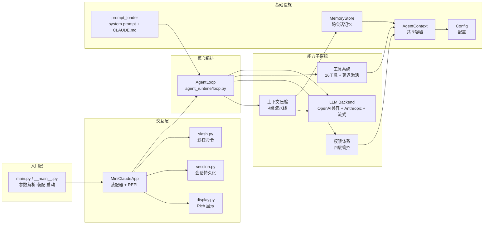
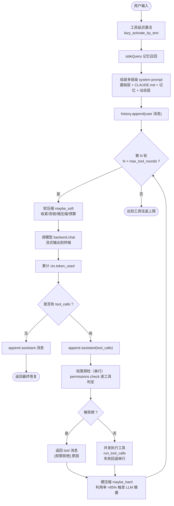
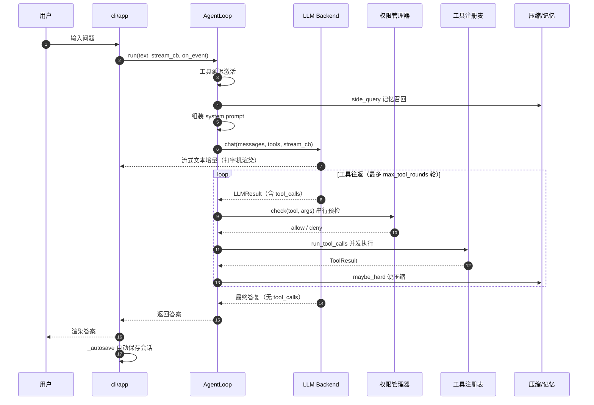
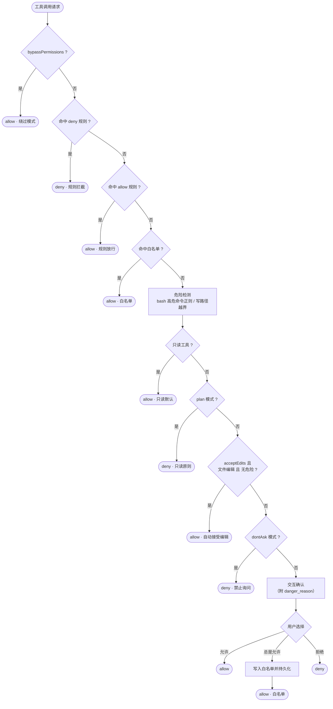
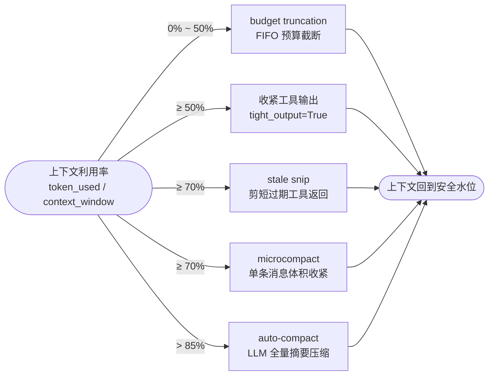
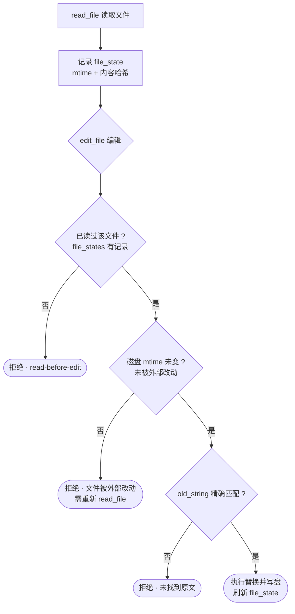
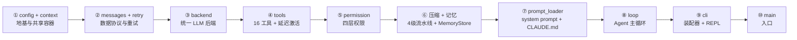

# MiniClaudeCode 流程图

> 本文档用 [Mermaid](https://mermaid.js.org) 绘制项目的核心流程图，覆盖架构、主循环、时序、权限、压缩与搭建顺序。
>
> **如何查看**：在 GitHub / GitLab 中打开本文件即可自动渲染；VS Code 安装
> 「Markdown Preview Mermaid Support」插件后可在预览中查看；也可用
> `npx -y @mermaid-js/mermaid-cli -i DIAGRAMS.md -o out.svg` 导出为图片。

---

## 1. 系统架构图

模块分层与依赖关系（数据流自顶向下，`AgentContext` 是共享容器）。

---

## 2. Agent 主循环流程图

一条用户消息从进入到产出答复的完整决策循环（对应 `loop.py` 的 `run`）。

---

## 3. 一次对话的时序图

---

## 4. 权限判定流程图

四层管控的完整判定链（对应 `permission/manager.py` 的 `check`，顺序即优先级）。

---

## 5. 上下文压缩流水线

4 级渐进式压缩，按上下文利用率分级触发（对应 `pipeline.py`）。

---

## 6. read-before-edit + mtime 校验流程

编辑文件的安全闸门（对应 `tools/file_tools.py` 的 `edit_file`）。

---

## 7. 搭建顺序图

从零搭建本项目的依赖驱动施工顺序（详见 `GUIDE.md` 第 14 章）。

